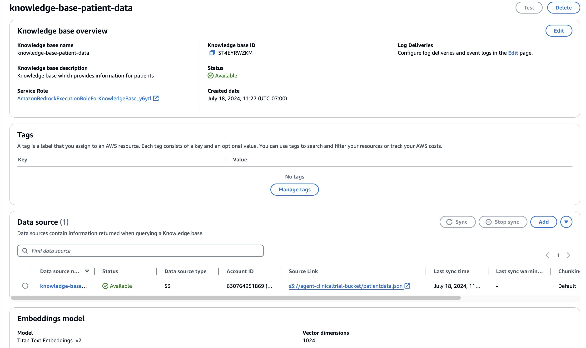
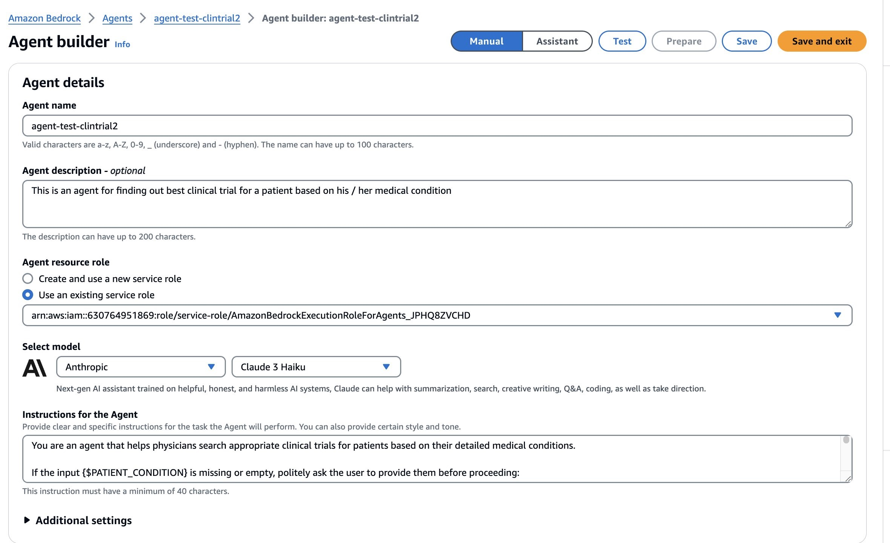
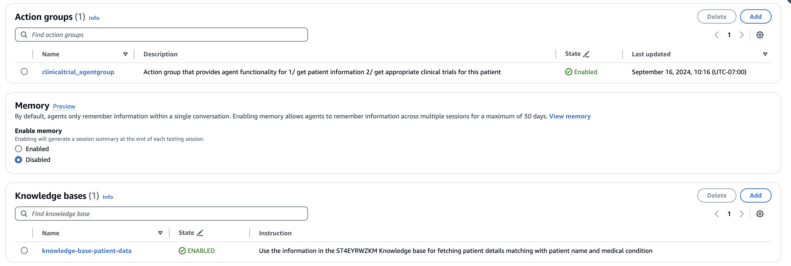
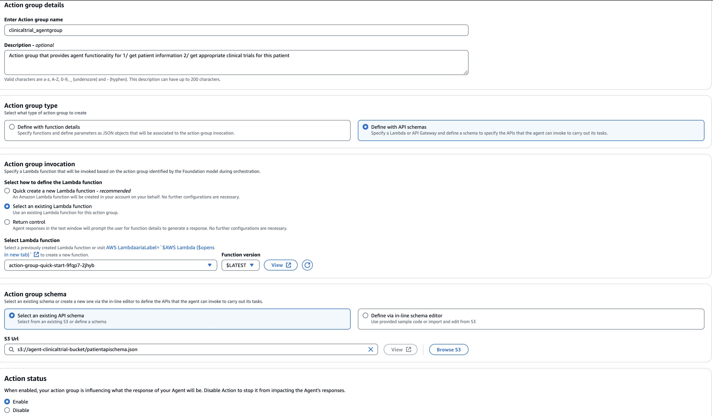

## Improving patient pre-screening for clinical trials with Generative AI on AWS


Clinicians face several challenges when trying to find and enroll patients inclinical trials. These include the lack of awareness, limited access to trial information especially for rare diseases, time constraints associated with identification of suitable trials and discussion with patients including convincing adherence to participation for successful outcomes. Typically, clinicians undertake a set of steps to find and evaluate clinical trials for their patients. These include identification of patients who would benefit from a clinical trial, collecting relevant medical information about patient diagnosis, stage and treatment history of disease, searching clinical trial registries and institutional review boards, reviewing eligibility criteria, discussing options with patients, obtaining their consent, facilitating enrolment and monitoring their participation.  One potential solution to streamline this process is to explore automate eligibility pre-screening. 

In this post, we present a Generative AI solution leveraging AWS services to facilitate a shorter turn around time for matching cancer patients to relevant clinical trials. In particular, this solution leverages Amazon Bedrock knowledge base and Amazon Bedrock agents to find relevant trials using patient’s medical condition and demographic data like age, gender, country etc. and then establishing matched trials based on their complex inclusion exclusion criteria. The solution incorporates chain of thought reasoning and explains the reason of selecting and not selecting a clinical trial. This explanation can highlight the key differences between the recommended matches, enabling clinicians to compare and contrast the available options more effectively, and eventually recommend the most appropriate trial for the patient. 

### Solution Overview

This solution uses agent-based framework on Amazon Bedrock that allows developers to model and simulate complex systems by executing multistep tasks across different systems and data sources . The entire workflow spans multiple tasks starting from a) Fetching patient relevant historical b) Querying clinical trials registry to fetch clinical trials to relevant to patient current condition and matching the trials related inclusion & exclusion criteria to patient historical attributes to narrow down to specific clinical trials . This entire process enables automation of the clinical trial pre-screening process which typically takes hours to few minutes .

### Techniques

#### Agent-Based Framework

Amazon Bedrock agents streamline workflows and automate repetitive tasks. 

##### Orchestrate and execute multistep tasks

With Amazon Bedrock you can create an agent in just a few quick steps, accelerating the time it takes to build generative AI applications. Yo have to first  select a model and write a few instructions in natural language. Agents orchestrate and analyze the task and break it down into the correct logical sequence using the FM’s reasoning abilities. Agents automatically call the necessary APIs toto fulfill the request, determining along the way if they can proceed or if they need to gather more information.

Amazon Bedrock Agents allow you to define an action schema and get the control back whenever the agent invokes the action. This helps you implement business logic in the backend service . Also, with return of control, you get the ability to execute time-consuming actions in the background (asynchronous execution) while continuing the orchestration flow.

The key components of agents on Amazon Bedrock include 
1) Configuration of the agent which includes defining the purpose of the agent and specifying the foundation model that would be used to generate prompts and responses 
2) Action groups which are used to define the actions that the agent is designed to perform 
3) Knowledge base which provides data sources that the agent can query to augment its generative capabilities and improve performance and accuracy.

##### Retrieval augmented generation

Amazon Bedrock Agents securely connects to healthcare provider data sources for patient historical information and augments the clinician request with the right information to generate an accurate response. The RAG agent looks up the knowledge base to retrieve patient historical information based on the patient demographics and current clinical condition. 

In this work, we used agent to understand clinician requests and break them down into smaller steps, for example; finding the patient details like patient ID and medical conditions based on the patient name and medical condition from the knowledge base. Based on the patient information retrieved from knowledge base, the agent searches for available trials based on age, medical condition, gender, country, etc. Once the relevant trials are retrieved, the agent works as a clinical trials analyst to carefully compare detailed patient medical information with the inclusion and exclusion criteria listed in fetched trials and then determines if the patient meets the criteria to join the clinical trial along with a reasoning. 

##### Trace through the chain-of-thought reasoning

You can step through the agent's reasoning and orchestration plan with the trace capability. With these insights, you can troubleshoot different orchestration issues to steer the model towards the desired behavior for a better user experience. Moreover, you can review the steps and adjust the instructions as you iterate on the application. With complete visibility into
the model's reasoning, you can create differentiated applications faster.

##### Prompt Engineering and Structure

The prompting strategy is based on emerging best practices and is illustrated below. To identify what criteria are screenable based on the patient medical summary, we use chain-of-thought prompting techniques. For each selected criterion the LLM is prompted to reason why it is met, not met or unknown. Finally, to allow automatic processing of the output , the model is prompted to convert the reasoning per criterion to a particular format 
For eg:  trialID - "meets_criteria": Yes/No, "reasons": 2-3 sentence explanation


### Dataset  
#### Synthetic Cancer Patient Profile Dataset

In this work, we have used a synthetic dataset. A typical sample of patient profile data contains the following patient information: patient id, patient name, age, gender, country, metastasis, condition such as lung cancer, adenocarcinoma of lung, cancer of cervix, chemotherapy status, radiotherapy status, histology, known biomarkers, everyday cognition scale (ECog) score, recurrence of condition and other information such as "smoker for 10 years".

The table below depicts the schema of the synthetic patient profile generated for patients with varying cancer types. 

Schema	Description
Patient id	Unique identifier for each patient
Patient name	Name of the patient
Condition	Type of cancer the patient is diagnosed with
Chemotherapy	Indicates whether the patient underwent chemotherapy treatment or not
Radiotherapy	Indicates whether the patient underwent radiotherapy treatment or not
Age	Age of the patient
Gender	Gender of the patient
Country	Country of residence of the patient
Metastasis	Indicates whether the cancer has metastasized (spread) or not
Histology	Histological subtype or characteristics of the cancer
Biomarker	Indicates the presence or absence of specific biomarkers related to the cancer
ECog score	Eastern Cooperative Oncology Group (ECOG) performance status score, indicating the patient's level of functioning
Condition recurrence	Indicates whether the cancer condition has recurred after initial treatment or not

#### Clinical trial registry 

ClinicalTrials.gov is a database maintained by the U.S. National Library of Medicine that provides public access to information on clinical studies involving human participants. Its primary purpose is to increase transparency, ensure ethical conduct, and facilitate the recruitment of participants for clinical trials investigating new medical treatments and interventions. 

This dataset contains clinical trial information such as study descriptions, including the purpose and eligibility criteria, cancer types being studied (e.g., breast cancer, lung cancer, leukemia), intervention details (e.g., drugs, biological products, procedures), study locations and recruitment status, study sponsors and collaborators. It also contains patient enrolment information, for example, number of participants enrolled in each study, target enrolment numbers, age group, and gender distribution of participants. There is also study start and completion dates, including study phase information such as Phase 1, 2 and 3. 

In this work, we used pytrials- a python wrapper around the clinicaltrials.gov public API that allows programmatic access and facilitates retrieval of data from this website.  

### Implementation

#### Clinical trial collection and matching workflow diagram


#### Architecture diagram

The architecture diagram illustrates the end-to-end workflow for matching cancer patients to relevant clinical trials using AWS services like Amazon Bedrock Agents, Knowledge Base, Amazon OpenSearch Service, and AWS Lambda functions. The clinician initiates the process by querying the clinical trials agent with the patient's details, which then fetches the medical history, leverages knowledge bases, and invokes different APIs to filter and recommend suitable trials based on the inclusion and exclusion criteria.


#### Installation
For running the streamlit application
1. Open the ui/InvokeAgent.py.
2. Update the AGENT ID and Agent ALIAS ID values.
3. streamlit run ui/mainapp.py

#### Key Steps in Implementation  

Following are the key steps for implementing this solution: 

1. The first step is to create an Amazon S3 bucket and upload the patient data with all the demographics, medical condition and medical information like histology, biomarkers etc. as shown in the synthetic cancer patient profile. The dataset is formatted in JavaScript Object Notation (JSON). Make sure to take the necessary steps to secure PHI data when storing on Amazon S3 .

2. Create a knowledge base in Amazon Bedrock knowledge-base-patient-data for retrieval of the patient data to augment the agent's knowledge with the patient's medical information. The Amazon Bedrock Knowledge Bases is a fully managed capability that helps implement the entire Retrieval Augmented Generation (RAG) workflow from ingestion to retrieval and prompt augmentation without having to build custom integrations to data sources and manage data flows. As part of this process, a vector index in Amazon OpenSearch Serverless is automatically created. For more information on how to set up a knowledge base, please refer to this link. Titan Text Embeddings v2 is the embeddings model used to embed the patient information on S3 bucket into 1024 dimension vector. If the patient data is updated with new patients or new medical information becomes available for existing patients overtime, a knowledge base can be synced with updated JSON file as explained here.


3. Create an agent in Bedrock. Follow the steps in this documentation to create an agent in the Bedrock console. Provide an agent name, its description and choose the large language model. Here we have chosen Claude 3 Haiku model.

Then we create an action group clinicaltrial_agentgroup and select the knowledge base knowledge-base-patient-data for the agent to use.


4. Configure the agent's action group clinicaltrial_agentgroup. We select the action group type as Define with API schemas and use an AWS Lambda function. By default, AWS Lambda is publicly accessible, for data protection make sure to follow the security guidelines as described in the security guide. An API schema is configured to define the API that the agent can invoke to carry out its tasks such as fetching the detailed patient information, and the list of all the trials with provided age, gender, country and medical condition from clinicaltrials.gov. Also, to ensure that PHI remains encrypted while using AWS Lambda, connections to external resources will use an encrypted protocol such as HTTPS or SSL/TLS.


5. The lambda functions provides following functionalities. It fetches patient information based on name and current medical condition as follows:

```
s3_clientobj = s3.get_object(Bucket=bucket, Key='patientdata.json')
    s3_patientdata = s3_clientobj['Body'].read().decode('utf-8')
    s3patientlist=json.loads(s3_patientdata)
    loclientdict={}
    matchedPatients=[item for item in s3patientlist if item["patientName"].lower() == p_name.lower() and item["condition"].lower() == c_name.lower()]
    if not matchedPatients:
        return loclientdict
    else:
        loclientdict=matchedPatients[0]
  ```      
 Based on the medical condition of the patient, fetch Phase 3 or Phase 4 clinical trials located in United States that are recruiting. For simplicity and validation purposes, we chose to set the maximum number of studies as 3 only. The information returned for each clinical trial is the National Clinical Trial number (NCT_ID) and eligibility criteria.

```
base_url = "https://clinicaltrials.gov/api/v2/studies"
    params = {
        "query.cond": search_expr,
        "query.term": "AREA[Phase](PHASE4 OR PHASE3)AND AREA[LocationCountry](United States)",
        "filter.overallStatus": "RECRUITING",
        "pageSize": max_studies
    }
```
All the trial information for a patient's medical condition is returned as a list.
  ```
    max_studies = 3
    search_expr = medicalCondition
    critlist, nctidlist = fetch_clinical_trial_data(search_expr,max_studies)
    loclientdict =[critlist,nctidlist]
```
6. Once the agent exits the action group, the Claude 3 Haiku LLM is prompted to compare eligibility criteria with the patient's detailed information to interpret and decide if the patient meets a study criteria. Specifically, the following part of the prompt serves the purpose. 

 ```
For each <trial> listed in <clinical_trials>:
<scratchpad>
-Extract the eligibility criteria from the <criteria> subsection
-Compare the criteria point-by-point against the patients <patient_details>
-Determine if the patient meets all criteria to be eligible for this trial
-If the trial location is NOT in location country (United States) or USA, automatically set "meets_criteria" to "No"
- Prepare a result in the specified format:
{{ trialID - "meets_criteria": Yes/No, "reasons": 2-3 sentence explanation }}
</scratchpad>

 ```
The LLM is also instructed to provide a result in a specific format, including a brief explanation of why the eligibility criteria were or were not met. 


#### Cleanup

To avoid incurring future charges, delete all the resources you deployed as part of the tutorial.
1. Delete the Bedrock agent created for the solution. Instructions and Action groups in this Agent will be deleted. Action groups copied from this Agent will not be deleted.
2. All versions and aliases in this Agent will be deleted.
3. Data sources associated with this Agent will not be deleted, make sure to explicitly delete the S3 bucket.

#### Conclusion 

In this solution , we demonstrated how an Agentic AI framework with Amazon Bedrock agents can streamline the process of matching cancer patients to relevant clinical trials. By leveraging generative AI capabilities, clinicians can automate the time-consuming task of reviewing eligibility criteria and comparing patients' medical histories against numerous trial requirements. 

The key benefits of this approach include increased efficiency, saving clinicians valuable time. Additionally, the agent's ability to reason through complex inclusion and exclusion criteria, combined with its access to patient data and clinical trial registries, enhances the accuracy of patient-trial matching. Furthermore, the agent provides a traceable and explainable chain of reasoning for its recommendations, allowing clinicians to understand the rationale behind suggested trial matches and make more informed decisions. As the number of clinical trials and patient data grows, the generative AI solution can scale to handle the increasing complexity, ensuring that clinicians are always presented with the most relevant trial options. This work can be extended by using data extract from Electronic Health Record for populating patient information in knowledge base, and using an event driven architecture to simulate the clinical settings. 

By leveraging the power of AWS services like Amazon Bedrock, healthcare providers can unlock new possibilities for streamlining clinical trial enrollment and accelerating the development of life-saving treatments. As generative AI continues to advance, its potential applications in the healthcare domain are vast, promising to revolutionize various aspects of patient care and medical research.


## Support
Contact authors listed if your interested in the solution.

## Authors and acknowledgment
Special thanks to Anurag Sharma, Priya Padate, Wale Akinfaderin, Ekta Walia Bhullar for their contributions to this project and sharing their expertise in this field.

## License
This library is licensed under the MIT-0 License. See the LICENSE file.


