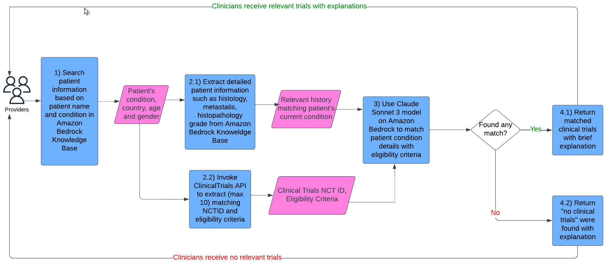
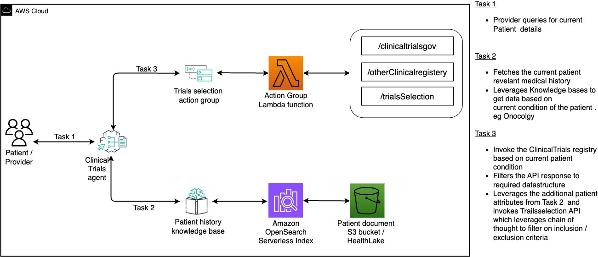

## Improving patient pre-screening for clinical trials with Generative AI on AWS

Clinicians face several challenges when trying to find and enroll patients inclinical trials. These include the lack of awareness, limited access to trial information especially for rare diseases, time constraints associated with identification of suitable trials and discussion with patients including convincing adherence to participation for successful outcomes. Typically, clinicians undertake a set of steps to find and evaluate clinical trials for their patients. These include identification of patients who would benefit from a clinical trial, collecting relevant medical information about patient diagnosis, stage and treatment history of disease, searching clinical trial registries and institutional review boards, reviewing eligibility criteria, discussing options with patients, obtaining their consent, facilitating enrolment and monitoring their participation.  One potential solution to streamline this process is to explore automate eligibility pre-screening. 

In this post, we present aGenerative AI driven solution leveraging AWS services to facilitate a shorter turn around time for matching cancer patients to relevant clinical trials. In particular, this solution leverages Amazon Bedrock knowledge base and Amazon Bedrock agents to find relevant trials using patient’s medical condition and demographic data like age, gender, country etc. and then establishing matched trials based on their complex inclusion exclusion criteria. The solution incorporates chain of thought reasoning and explains the reason of selecting and not selecting a clinical trial. This explanation can highlight the key differences between the recommended matches, enabling clinicians to compare and contrast the available options more effectively, and eventually recommend the most appropriate trial for the patient. 

### Solution Overview

This blog post uses agent-based framework on Amazon Bedrock that allows developers to model and simulate complex systems by executing multistep tasks across different systems and data sources . The entire workflow spans multiple tasks 
starting from a) Fetching patient relevant historical b) Querying clinical trials registry to fetch clinical trials to relevant to patient current condition and matching the trials related inclusion & exclusion criteria to patient historical attributes to narrow down to specific clinical trials . This entire process enables automation of the clinical trial pre-screening process which typically takes hours to few minutes .

### Techniques

#### Agent-Based Framework

Amazon Bedrock agents streamline workflows and automate repetitive tasks. 

##### Orchestrate and execute multistep tasks

With Amazon Bedrock you can create an agent in just a few quick steps, accelerating the time it takes to build generative AI applications. Yo have to first  select a model and write a few instructions in natural language. Agents orchestrate and analyze the task and break it down into the correct logical sequence using the FM’s reasoning abilities. Agents automatically call the necessary APIs toto fulfill the request, determining along the way if they can proceed or if they need to gather more information.

Amazon Bedrock Agents allow you to define an action schema and get the control back whenever the agent invokes the action. This helps you implement business logic in the backend service . Also, with return of control, you get the ability to execute time-consuming actions in the background (asynchronous execution) while continuing the orchestration flow.

The key components of agents on Amazon Bedrock include 
1) Configuration of the agent which includes defining the purpose of the agent and specifying the foundation model that would be used to generate prompts and responses 
2)Action groups which are used to define the actions that the agent is designed to perform 
3)Knowledge base which provides data sources that the agent can query to augment its generative capabilities and improve performance and accuracy.

##### Trace through the chain-of-thought reasoning

You can step through the agent's reasoning and orchestration plan with the trace capability. With these insights, you can troubleshoot different orchestration issues to steer the model towards the desired behavior for a better user experience. Moreover, you can review the steps and adjust the instructions as you iterate on the application. With complete visibility into
the model's reasoning, you can create differentiated applications faster.

##### Prompt Engineering and Structure

The prompting strategy is based on emerging best practices and is illustrated below. To identify what criteria are screenable based on the patient medical summary, we use chain-of-thought prompting techniques. For each selected criterion the LLM is prompted to reason why it is met, not met or unknown. Finally, to allow automatic processing of the output , the model is prompted to convert the reasoning per criterion to a particular format 
For eg:  trialID - "meets_criteria": Yes/No, "reasons": 2-3 sentence explanation

### Clinical trial collection and matching workflow diagram

### Architecture diagram 

## Installation
For running the streamlit application
1. Open the ui/InvokeAgent.py.
2. Update the AGENT ID and Agent ALIAS ID values.
3. streamlit run ui/mainapp.py

## Support
Contact authors listed if your interested in the solution.

## Authors and acknowledgment
Special thanks to Anurag Sharma, Priya Padate, Wale Akinfaderin, Ekta Walia Bhullar for their contributions to this project and sharing their expertise in this field.

## License
This library is licensed under the MIT-0 License. See the LICENSE file.

